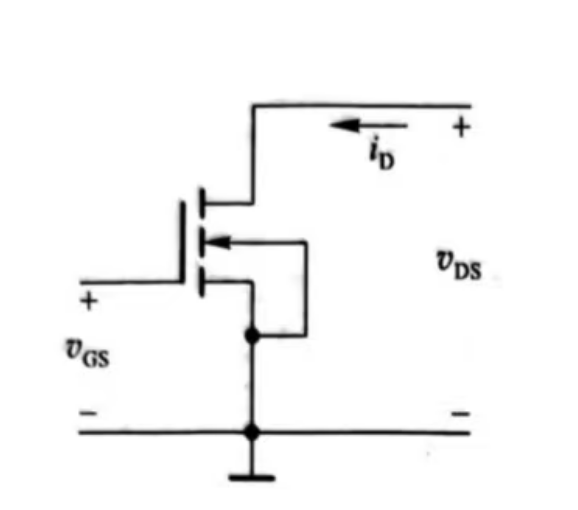
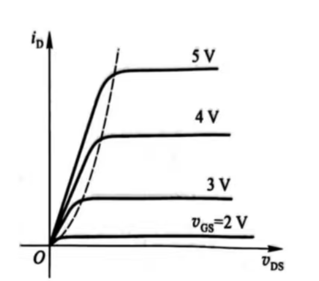
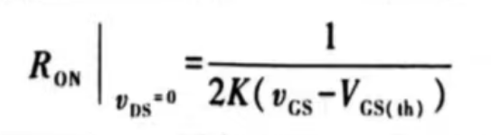
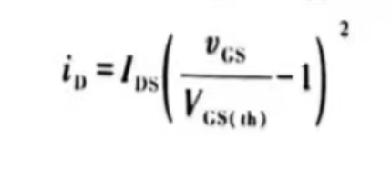

# MOS管的开关特性
## MOS管的输入特性和输出特性

 
    

截止区：当 VGS < VGS(th) 时，id $\approx$ 0，D-S间的R极大  
可变电阻区：当 VGS > VGS(th) 时且在虚线左侧，当 VGS 一定时 iD 与 VGS 之比约等于一个常数，等效电阻的大小与 VGS 有关  
当 VDS $\approx$ 0，MOS管导电阻 RON 和 VGS的关系  

  

    
恒流区：虚线右侧，iD 大小由 VGS 决定   

 
  

