# MOS管的开关特性
## MOS管的输入特性和输出特性

截止区：当 VGS < VGS(th) 时，id $\approx$ 0，D-S间的R极大    
可变电阻区：当 VGS > VGS(th) 时且在虚线左侧，当 VGS 一定时 iD 与 VGS 之比约等于一个常数，等效电阻的大小与 VGS 有关  
当 VDS $\approx$ 0，MOS管导电阻 RON 和 VGS 的关系  
$$
R_{ON}\big|_{v_{DS}=0}
=
\frac{1}{2K(v_{GS}-V_{GS(th)})}
$$ 
恒流区：虚线右侧，iD 大小由 VGS 决定   
$$
i_D = I_{DS}\left(\frac{v_{GS}}{V_{GS(th)}} - 1\right)^2
$$
## MOS管的基本开关电路

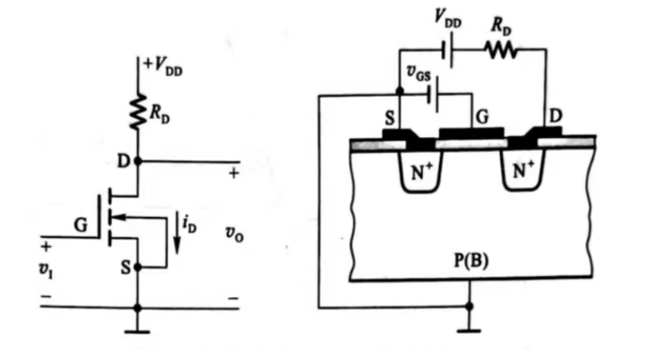  

当 VI = VGS < VGS(th) ，MOS管工作在截止区，只要 RD << MOS管的截止内阻 ROFF ，输出为high，VOH $\approx$ VDD  
当 VI > VGS(th) 且 VDS 比较高，工作在恒流区，随着 VI 升高 Id 升高 VO 下降  
当VI 继续升高，MOS管的导通内阻变得很小，MOS输出high，开关电路输出low   

# CMOS反相器

## CMOS反相器的电路结构

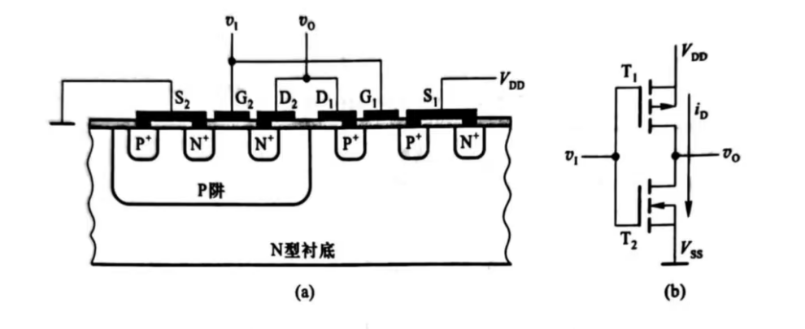   
T1 和 T2 的开启电压为 VGS(th)P 和 VGS(th)N，VDD > VGS(th)N + | VGS(th)P |
当 VI = VIL = 0    
$$
\left\{
\begin{aligned}
|v_{GS1}| &= V_{DD} > |V_{GS(th)P}| \\
v_{GS2} &= 0 < V_{GS(th)N}
\end{aligned}
\right.
\qquad
(\text{且 } v_{GS1} \text{ 为负})
$$
T1 导通，且导通内阻小，T2截止，内阻很大，输出为 VOH，VOH $\approx$ VDD  
当 VI = VOH = VDD  
$$
\left\{
\begin{aligned}
v_{GS1} &= 0 < |V_{GS(th)P}| \\
v_{GS2} &= V_{DD} > V_{GS(th)N}
\end{aligned}
\right.
$$
T1 截止 T2导通，输出为 VOL，VOL $\approx$ 0  

## 电压传输特性和电流传输特性
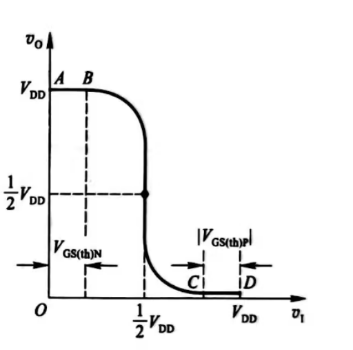  
设 VDD > VGS(th)N + | VGS(th)P |，且 VGS(th)N =  | VGS(th)P |     
位于AB段时， V1 <  VGS(th)N ，| VGS1 | > | VGS(th)P |，故T1导通并工作在低电阻的电阻区， VO = VOH $\approx$ VDD   
位于CD段时， V1 > VDD - | VGS(th)P |，| VGS1 | < | VGS(th)P |，T2导通，VO = VOL $\approx$ 0  
位于BC段时， VGS(th)N <  V1 < VDD - | VGS(th)P |，VGS2 > VGS(th)N ，| VGS1 | > | VGS(th)P |，T1 T2同时导通  
若T1和T2参数一致， V1 =  $\frac{1}{2}$VDD 时两者导通内阻相等，中点输入电压称为反相器的阈值电压 VTH  

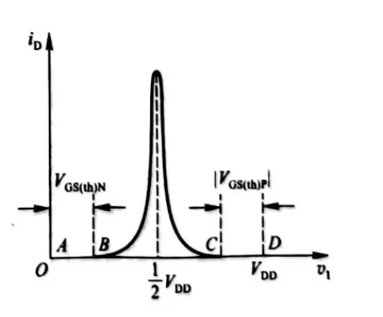  
位于AB段时，T2截止，内阻很大，流过T1和T2的漏极电流几乎等于0  
位于CD段时，T1截止，内阻很大，流过T1和T2的漏极电流几乎等于0   
位于BC段时，T1和T2同时导通，当 V1 =  $\frac{1}{2}$VDD 附近时Id最大   

## 输入噪声容限
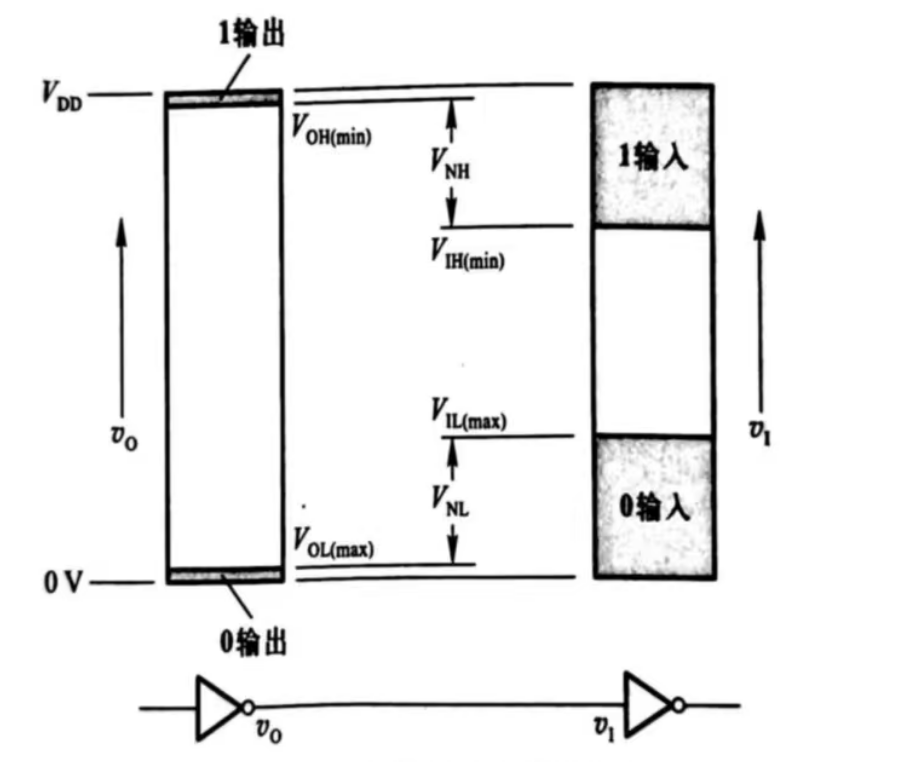  
在保证输出高、低电(变化的大小不超过规定的允许限度)的条件下，允许输入信号的高、低电平有一个波动范围，这个范围称为输入端的噪声容限   
输入为high时  
$$
V_{NH}=V_{OH(min)}-V_{IH(min)}
$$
输入为low时  
$$
V_{NL}=V_{OL(max)}-V_{IL(max)}
$$
## 静态输入特性和输出特性
### 输入特性
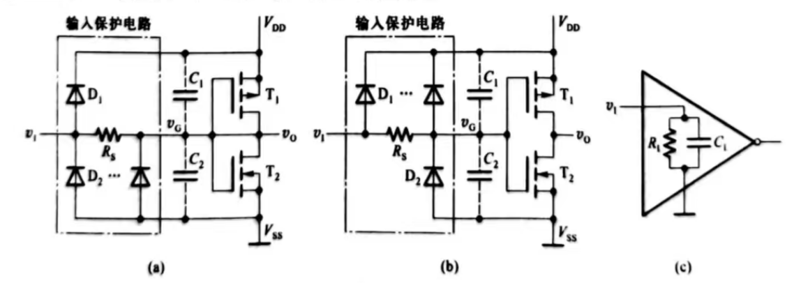  
输入信号电压在$0 \le V_{1} \le V_{DD}$范围内时，输入保护电路不起作用  
若二极管的正向导通压降为$V_{DF}$，则$V_{1}>V_{DF}+V_{DD}$，D1导通，将T1和T2的栅极点位$V_{G}$钳在$V_{DF}+V_{DD}$   
当$V_{1}<-0.7V$时，D2导通，将T1和T2的栅极点位$V_{G}$钳在$-V_{DF}$     
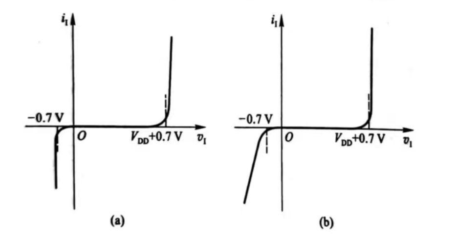  
### 输出特性
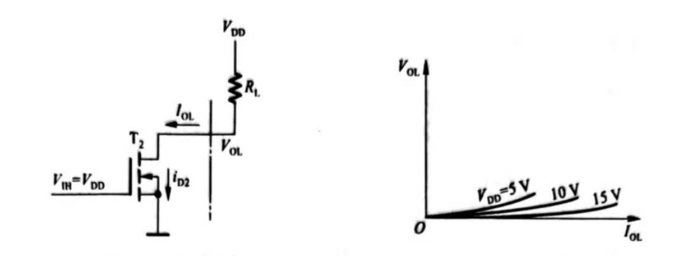  
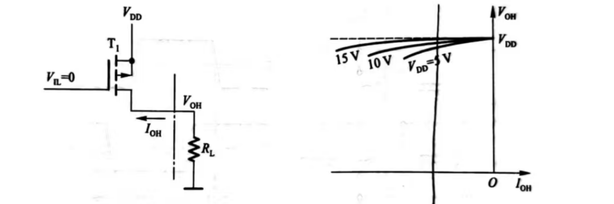
## 动态特性
### 传输延迟时间
输出电压变化落后于输入电压变化的时间称为传输延迟时间  
输出由high跳变为low的传输延迟时间$t_{PHL}$   
输出由low跳变为high的传输延迟时间$t_{PLH}$  
$t_{PLH}$和$t_{PHL}$通常相等，用平均传输延迟时间$t_{pd}$表示$t_{PHL}$和$t_{PLH}$    
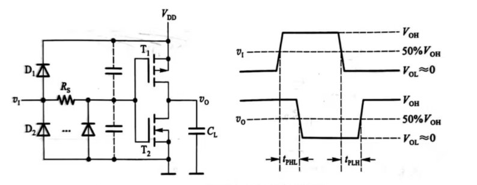  
### 动态功耗  
当CMOS反相器从稳定工作状态转变到另一种工作状态，将产生的功耗称为动态功耗  
动态功耗分为对负载电容充放电所消耗的功耗$P_{C}$和两个MOS管在短时间同时导通所消耗的瞬时导通功耗$P_{T}$  
计算$P_{C}$    
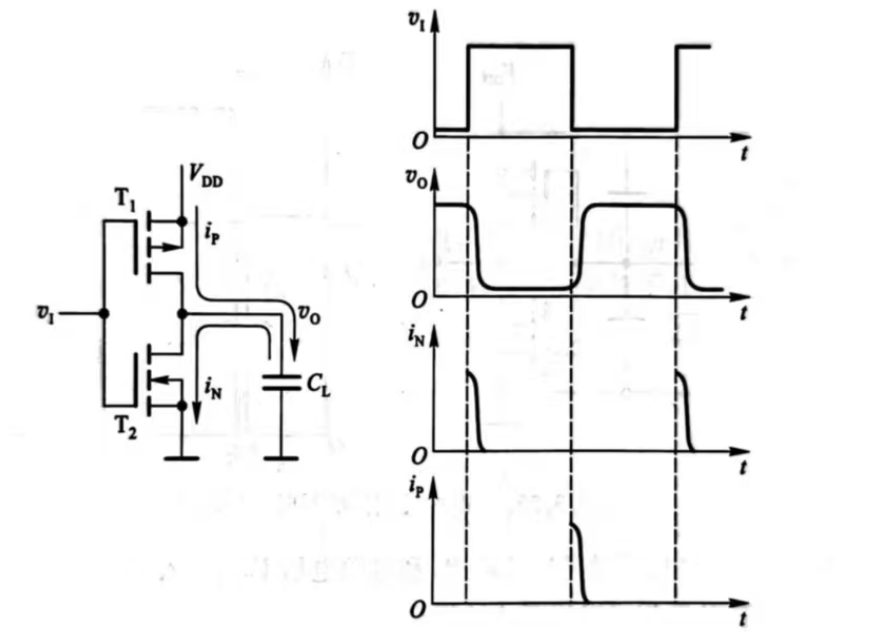   
$C_{L}$表示反相器输出端的所有电容  
当输入电压high跳变为low时（输出电压变化与输入电压变化相反），T1导通，T2截止，$V_{DD}$经T1向$C_{L}$充电，产生充电电流$i_{P}$  
当输入电压low跳变为high时（输出电压变化与输入电压变化相反），T2导通，T1截止，$C_{L}$经T2向放电，产生放电电流$i_{N}$  
So平均功耗$P_{C}$
$$
P_c=\frac{1}{T}\left[\int_0^{T/2} i_N v_o\,dt+\int_{T/2}^{T} i_P(V_{DD}-v_o)\,dt\right]
$$
$$
i_N=-C_L\frac{dv_o}{dt}
$$
$$
i_P=C_L\frac{dv_o}{dt}
=-C_L\frac{d(V_{DD}-v_o)}{dt}
$$
$$
P_c=\frac{1}{T}\left[
C_L\int_{V_{DD}}^{0}-v_o\,dv_o
+
C_L\int_{V_{DD}}^{0}
-(V_{DD}-v_o)\,d(V_{DD}-v_o)
\right]
$$

$$
=\frac{C_L}{T}\left[
\frac{1}{2}V_{DD}^2
+
\frac{1}{2}V_{DD}^2
\right]
$$
$$
=C_LfV_{DD}^2
$$
式子中$f=\frac{1}{T}$为输入信号的重复频率  
计算瞬时导通功耗$P_{T}$  
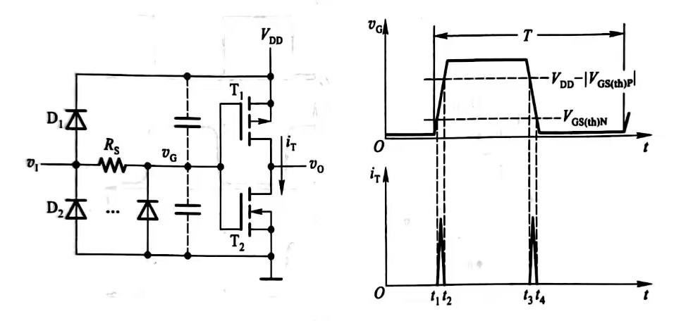   
$$
P_T=C_{PD}fV_{DD}^2
$$  
$C_{PD}$是功耗电容  
总功耗
$$
P_{D}=P_{C}+P_{T}  
     =(C_{L}+C_{PD})fV_{DD}^2
$$