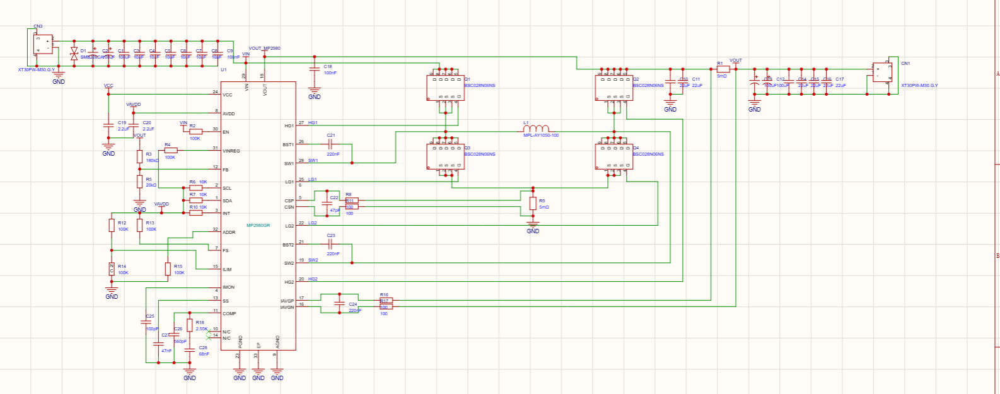
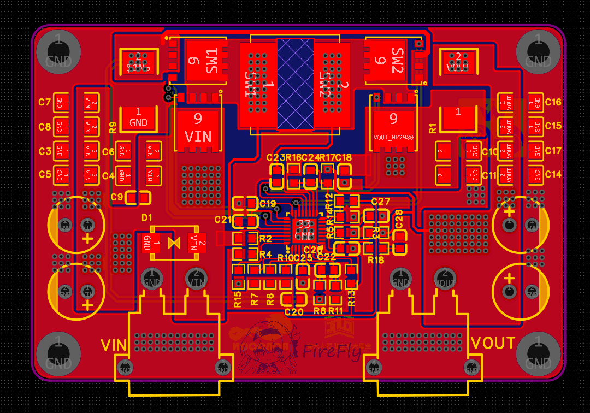
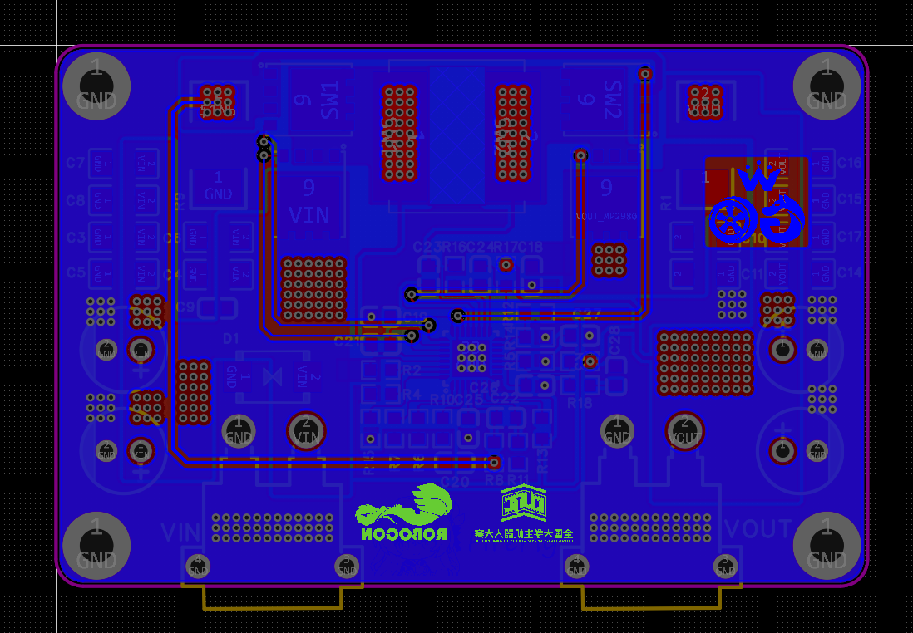

[MP2980GR数据手册](https://www.monolithicpower.cn/cn/documentview/productdocument/index/version/2/document_type/Datasheet/lang/en/sku/MP2980GR/document_id/11523/)

# 性能参数
输入电压：6V~36V  
输出电压：0.5V~36V  
输出电流：10A@MAX（取决于MOS管、散热片和过流保护采样电阻）  
最高效率：待测  
纹波：待测  
# 原理图

# PCB

# 实物

# 电路设计要点
##  电阻计算
基准电压VREF=0.5V，通过FB分压  
$$R1 = R2 \times \frac{V_{OUT} - 0.5V}{0.5V}$$
取 R2 = 20kΩ（常用值，范围 1k~50kΩ）即 R1 = 180kΩ
## 电感计算
降压模式下  
$$
L_{BUCK} = \frac{V_{OUT}}{f_{SW} \times \Delta I_L} \times (1 - \frac{V_{OUT}}{V_{IN}})$$  
## 输入电容
推荐：6 × 10µF/25V 1210
## 输出电容
推荐：4×22µF 陶瓷电容（25V）+ 2×100µF 铝电解电容 降低纹波和改善瞬态  
## 软启动电容
$$t_{SS}(ms) = \frac{C_{SS}(nF) \times V_{REF}(V)}{6\mu A}$$
选择MPS送的10uf电容，计算得$t_{SS}=83ms$  
# 芯片测试数据  
