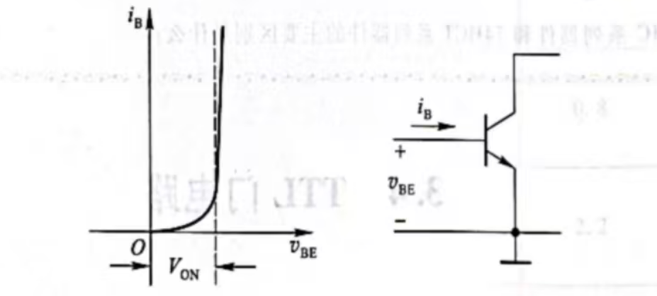
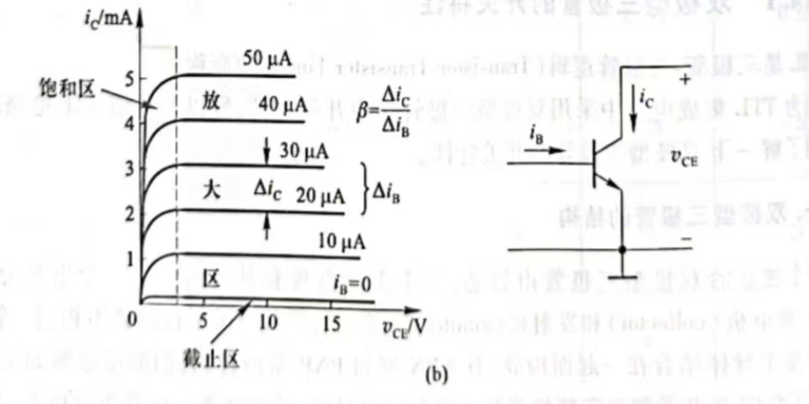
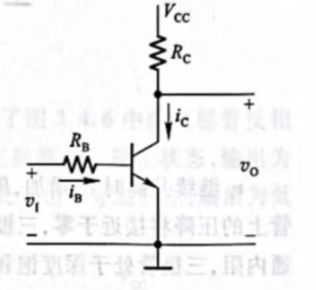

# 双极性三级管  
## 输入特性和输出特性
  
$V_{ON}$为开启电压（硅三极管$V_{ON}$为0.5-0.7V，锗三极管的$V_{ON}$为0.2-0.3V）  
  
放大区：特性曲线右边水平的部分为放大区（线性区），$I_{C}$随$I_{B}$正比变化，几乎不受$V_{CE}$影响  
电流放大系数$\beta=\frac{\Delta i_c}{\Delta i_b}$  
饱和区：曲线靠近坐标轴的部分为饱和区，$I_{C}$不再随$I_{B}$的$\beta$倍的比例增加而趋向饱和（硅三极管开始进入饱和区的$V_{CE}$约为0.6-0.7V）  
截止区：$i_{B}=0$以下的区域为截止区，$i_{C}$几乎等于0  
## 基本开关电路
  
当输入电压$V_{I}=0$时，三极管$V_{BE}=0$,三极管处于截止态,由输入特性曲线可得，在$V_{I}<V_{ON}$时，三极管处于截止态，$i_{B}=0$,由输出特性曲线得，$i_{B}=i_{C}=0$,电阻$R_{C}$上无压降，输出为$V_{OH}=V_{CC}$  
当$V_{I}>V_{ON}$后，$i_{B}$产生，$i_{C}$流过$R_{C}$和三极管，三极管在放大区  
基极电流  
$$i_B = \frac{v_I - V_{ON}}{R_B}$$
若三极管电流放大系数为$\beta$  
$$
\begin{aligned}
v_O &= v_{CE} = V_{CC} - i_C R_C \\
    &= V_{CC} - \beta i_B R_C
\end{aligned}
$$
由此可得，随着$V_{I}$升高$i_{B}$增加，$R_{C}$上压降增加，$V_{O}$减小  
当$R_{C}$和$\beta$足够大而$R_{B}$不是特别大，$\Delta v_O$远远大于$\Delta v_I$  
电压放大倍数$A_{v}=-\frac{\Delta v_O}{\Delta v_I}$（负号代表$V_{O}$与$V_{I}$变化方向相反）  

