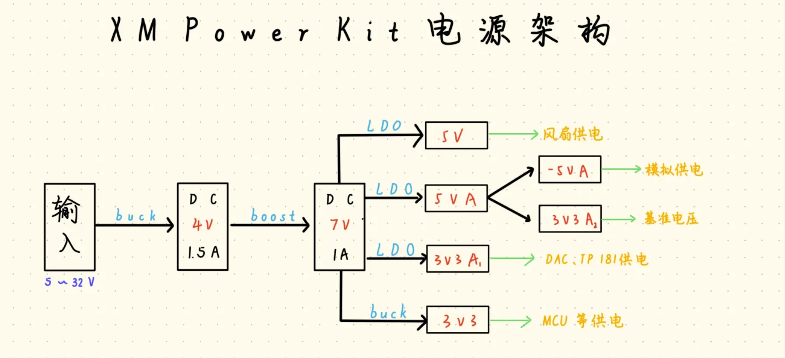
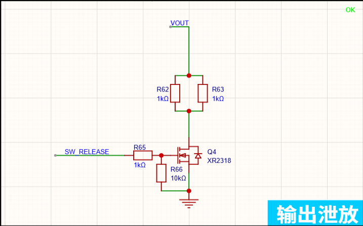
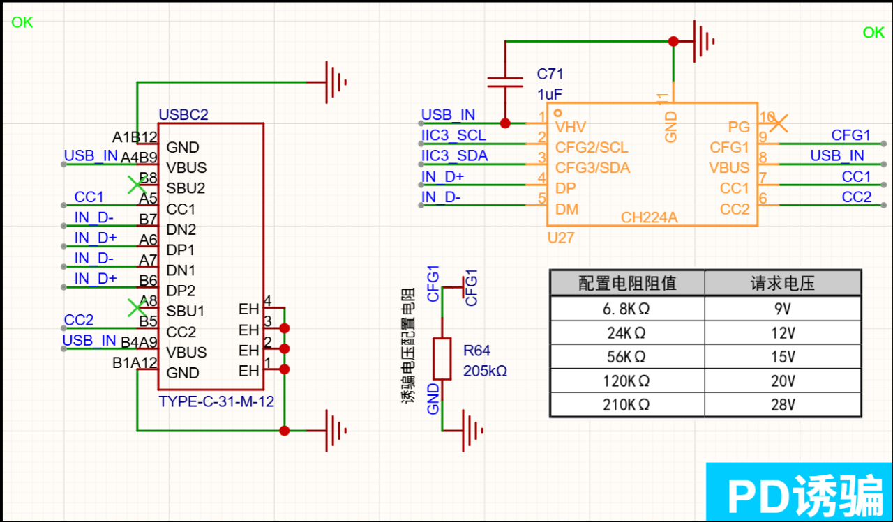
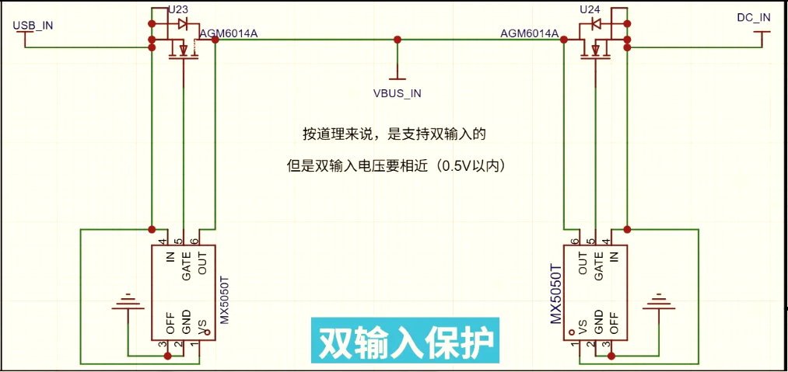
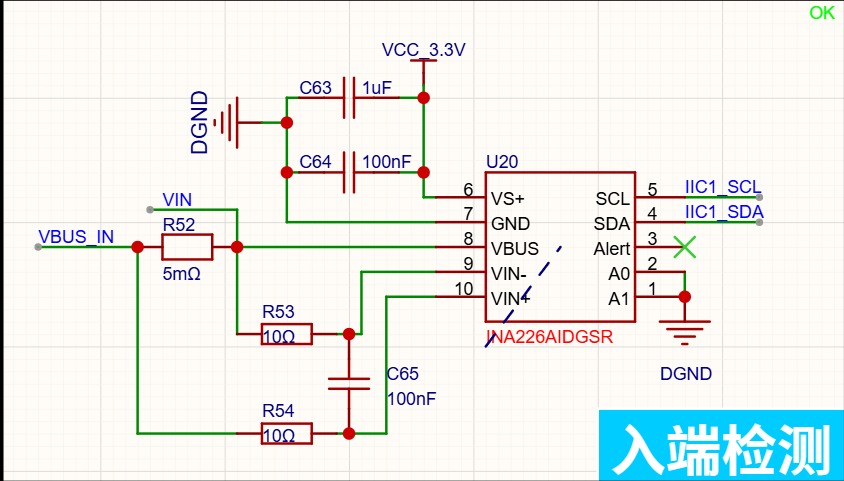
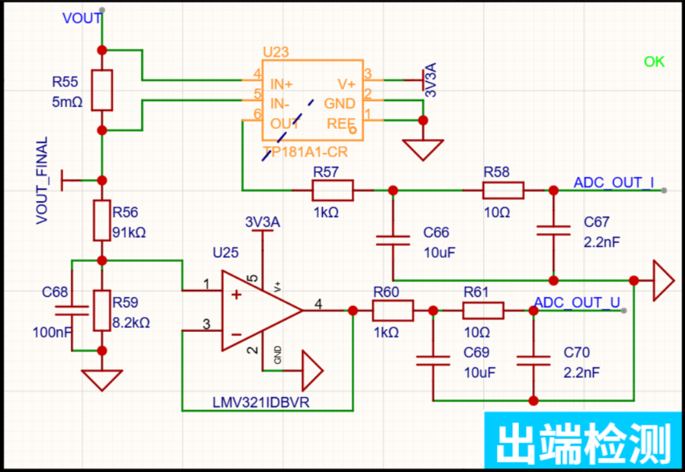
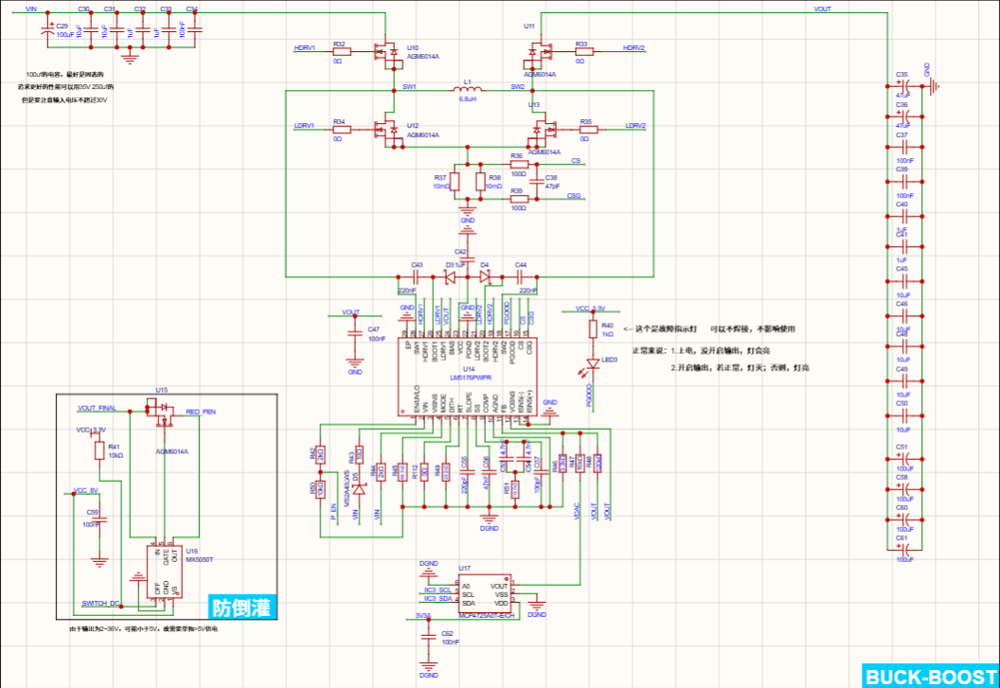
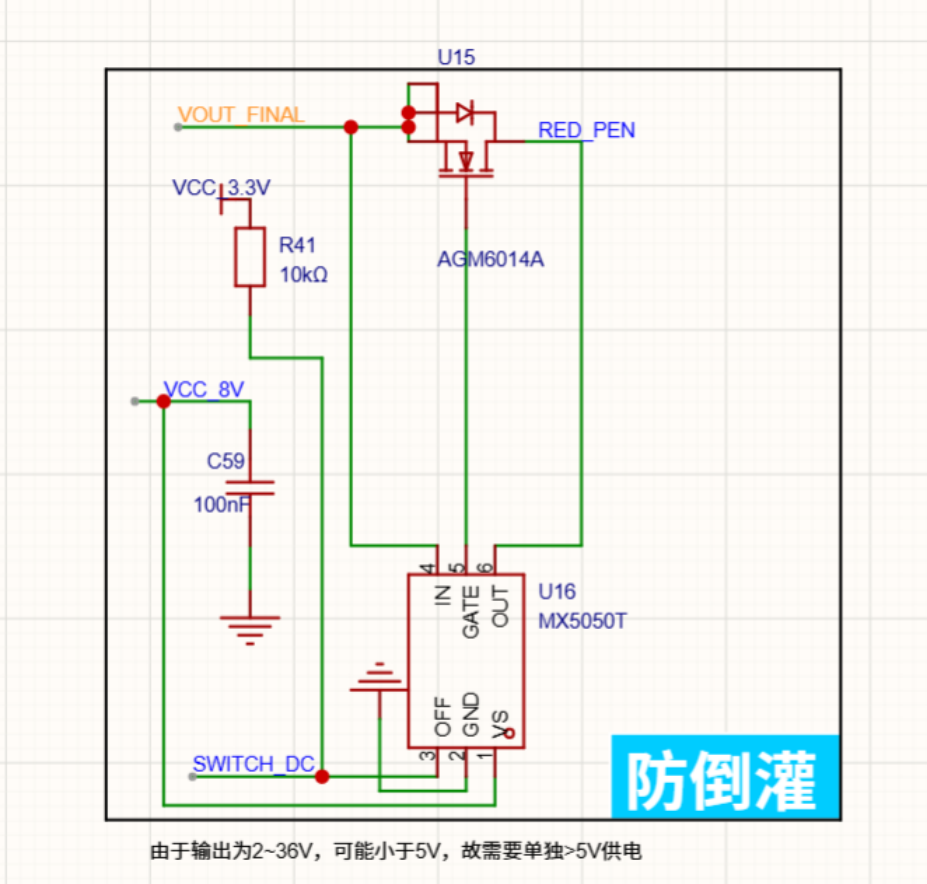

# 输入&电源
## 电源总体架构
  
核心目标就是将数字电源与模拟电源隔离，提高效率降低噪声，因为MCU不怕脏电，模拟电路怕噪声   
因为输入电压为5-32V，是宽输入系统，输入变化大，通过BUCK到4V（BUCK效率高，发热小，适合大压差，一般BUCK难以实现100%占空比，即使输入5V也能正常工作），然后Boost到7V（LDO需要压差，输入过小会使纹波变差，掉压）   
MCU供电用buck，提高效率，数字系统供电可允许有一点纹波  
DAC供电最怕数字噪声，单独LDO可避免MCU，时钟噪声  
基准电压不稳定会导致整个系统抖动，So基准电压需要比模拟供电还要干净  
### LDO&Buck&Boost比较
| 类型    | 本质   | 特点     |
| ----- | ---- | ------ |
| LDO   | 线性调节 | 干净 低效率 发热大 |
| Buck  | 开关降压 | 高效率降压  纹波大 |
| Boost | 开关升压 | 高效率升压  纹波大 |

## 输出泄放电路
###  让输出电压快速掉下去
数控电源输出通常需并联大电容（比如输出24V调成5V），输出电容还存着电，电压会慢慢下降
$$
E=\frac{1}{2}CU^2
$$
So输出泄放电路可以在降压或关闭输出自动接一个耗电通道，把电容里的电快速放掉   
### 防止回灌
比如接MCU，MOS，电机，残余电压可能导致芯片没断电，MCU死机，风扇慢慢转
### 主动泄放电路图
  
R62和R63并联阻值变500Ω，功率容量翻倍  
R66将栅极下拉到地，默认关闭MOS，防止悬空   
R65可以与MOS的栅极电容充电，减小瞬间电流  
放电速度
$$
\tau = RC
$$
假设输出电容$C=1000μF$,泄放电阻$R=500Ω$,时间常数$\tau=0,5s$,输出24V   
最大泄放电流 
$$
I=\frac{24}{500}=48mA  
$$
最大泄放功率
$$
P=\frac{24^2}{500}=1.15W
$$
## PD诱骗
[CH224A芯片手册](https://www.semiee.com/file2/503651f5692758e97cb3b3756c6d29b4/WCH/WCH-CH224DS1_V2.0.PDF)  
  
## 双输入保护 
[MX5050T](https://www.semiee.com/file2/fcaa327a011006ce89bff922fd22cdea/Maxinmicro/Maxinmicro-MX5050T-DS-2301-V13.pdf)
  
1. 具体工作流程  
   1. 一端上电后MOS管体二极管(寄生二极管)导通，VBUS电位上升   
   2. MX5050T检测压差，$V_{IN}-V_{OUT}>30mV$时开始给MOS栅极充电  
   3. MX5050T内有电荷泵将MOS管G级拉高，$V_{GS}>V_{th}$，MOS管导通  
   4. 原来体二极管的压降为0.7V，压降消失(电流从体二极管转向MOS沟道)   
2. 防倒灌电流     
假设VBUS被DC拉到5V，左端的$OUT>IN$，即$V_{OUT}-V_{IN}>28mV$,芯片关闭MOS
## 入端检测
[INA226](https://www.semiee.com/file2/c08b2bf94bdfa42743f99b027c4c35ea/TI/TI-INA226.pdf)  

这个电路用来检测USB输入的电压和电流，MCU通过I2C读取数据  
采样电阻R52（一般选2512封装1W），电流流过时产生压降，VIN+接高电位，VIN-接低电位  
R53-R54-C65组成差分RC低通滤波器，可降低开关电源噪声  
$$
X_{C}=\frac{1}{2πfC}
$$
$f$越大，电容阻抗越小，高频差模尖峰出现时，电容短接高频差分噪声，VIN+和VIN-拉近，差值变小，R53和R54起阻尼和限流的作用  
C63和C64为电源去耦，经典组合1uF+100nF，分别滤低频和高频
## 出端检测
[TP181](https://www.semiee.com/file2/5972528eef85c01227af3584744870bc/3PEAK/3PEAK-TP181.pdf)
  
这个电路实现输出电流检测ADC_OUT_I，输出电压检测ADC_OUT_U  
先看上半部分，IN+和IN-形成差分电压，经过电流检测放大器IP181A1放大输出  
基准电压REF接地，输出为单向电流检测，若接1.65v，输出为正负双向电流   
最后输出为与电流成比例的模拟电压  
截止频率
$$
f_{C}=\frac{1}{2πRC}
$$  
R57+C66形成一级低通滤波，$f_{C}≈16Hz$，输出的是慢慢变化的平均值，为平均滤波  
R58和C67形成二级高通滤波，$f_{C}≈7MHz$，主要抗瞬态尖峰，为ADC输入隔离  
再看下半部分，R56与R59分压，C68分压滤波  
电压跟随器LMV321(电压跟随器的输入阻抗大，输出阻抗小)形成一个Buffer(缓冲器)增强驱动ADC
## Buck-Boost电路
[LM5176](https://www.semiee.com/file2/dcb01af1fff7861bf32e9eefe10344f5/TI/TI-LM5176.pdf)
  
### 输入滤波
减小输入纹波，给芯片提供瞬态电流
### 同步四开关Buck-Boost
先看左半部分，Buck桥(输入半桥)，当处于Buck模式时，U11常导通，U13常关闭，U10 PWM，U12 同步整流  
工作状态：U10 ON U12 OFF，电感充电 U10 OFF U12 ON，电感续流  
再看右半部分，Boost桥，当处于Boost模式时，U10常导通，U12常关闭，U11 PWM，U13 同步整流  
工作状态：U11 OFF U13 ON，电感储能 U11 ON U13 OFF，电感放能  
当处于Buck-Boost模式时(输入电压接近输出电压)，通过调整U10和U11占空比，控制电感平均电流和输出电压
### 电流采样
R37和R38并联采样，分摊功耗  
R36 R39 C38组成RC差分滤波器，因为SW1和SW2高速开关节点产生噪声，影响采样  
### 自举驱动
C42给VCC稳压  
D3+C43
先让低边MOS导通，给电容充电，充满后BOOT=5V，SW=0V
高边MOS导通,SW上升到24V,电容两端电压不能突变，BOOT上升到29V，使MOS导通(Gate、BOOT、SW一起往上移动，而VGS始终维持在几伏左右)
### 防倒灌
  
